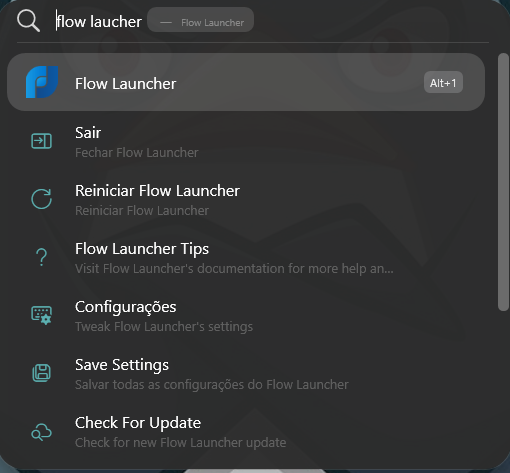

# Flow Launcher - Configuração Tahoe

Configuração e personalização do Flow Launcher para Windows,
utilizando o tema Flow Tahoe e uma interface inspirada no Spotlight
do macOS Tahoe.

## O que é o Flow Launcher?

O Flow Launcher é um launcher e mecanismo de busca rápido para Windows.

A partir de uma única janela, é possível localizar e abrir aplicativos,
arquivos e configurações, realizar pesquisas na web, executar comandos
e ampliar suas funções por meio de plugins.

A proposta é reduzir a necessidade de navegar por menus e pastas,
mantendo o acesso às ferramentas do sistema rápido e centralizado.

## Por que escolhemos o Flow Launcher?

A escolha foi baseada principalmente em três pontos:

- acesso rápido por teclado;
- possibilidade de pesquisar e executar diferentes recursos a partir
  de uma única interface;
- alto nível de personalização visual e funcional.

No nosso ambiente, o Flow Launcher funciona como uma camada de acesso
rápido ao Windows, mantendo a Área de Trabalho limpa e reduzindo a
necessidade de procurar manualmente por aplicativos e ferramentas.

## Por que o Flow Tahoe?

O tema Flow Tahoe foi escolhido por aproximar a experiência visual
do Flow Launcher à aparência do Spotlight do macOS Tahoe.

A intenção não foi transformar o Windows em uma cópia do macOS, mas
criar uma interface visualmente familiar, limpa e discreta.

## O que foi personalizado?

A configuração utiliza o tema Flow Tahoe com os seguintes ajustes:

- Fixed Window Size: ativado
- Maximum Results: 7
- Show Placeholder: desativado

O tema foi instalado manualmente na pasta de temas do Flow Launcher.

Não foram necessárias alterações no arquivo original do tema.

## Resultado

O resultado é uma interface compacta, escura e organizada, com acesso
rápido aos aplicativos, arquivos e recursos do sistema.

## Documentação

A configuração detalhada está disponível em:

[`docs/CONFIGURACAO.md`](docs/CONFIGURACAO.md)

## Filosofia

A personalização segue uma regra simples:

> Alterar somente o necessário.

O objetivo não é adicionar recursos ou efeitos apenas porque são
possíveis, mas chegar a uma interface que seja simples, objetiva,
operante, funcional e elegante.

## Créditos

- [Flow Launcher](https://github.com/Flow-Launcher/Flow.Launcher)
- [Flow Tahoe](https://github.com/LucasM314/Flow-Tahoe)